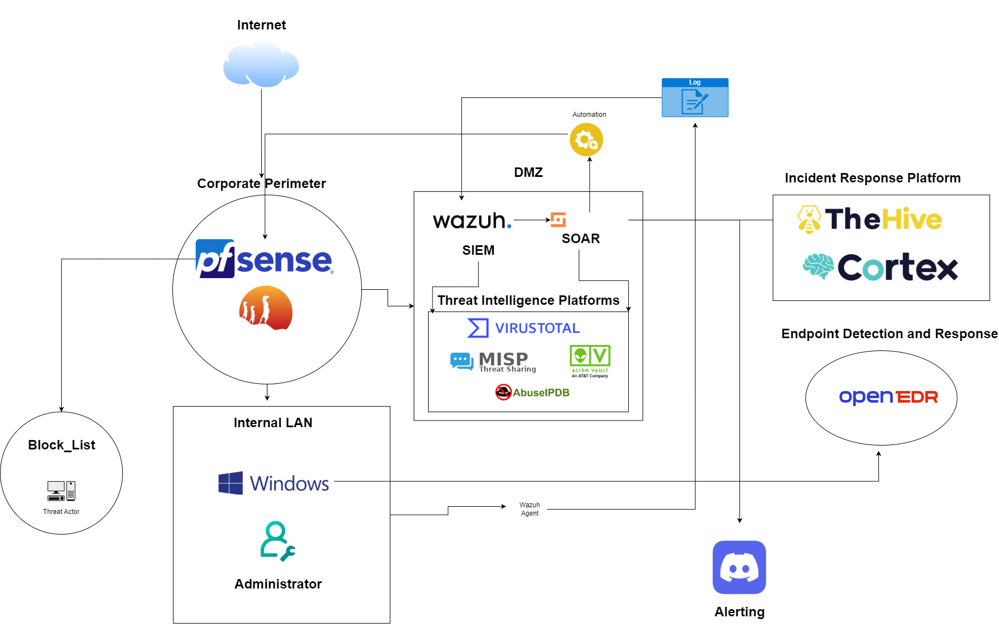
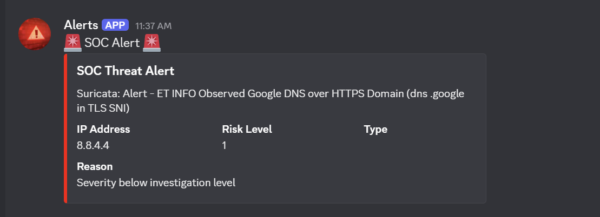

<div align="center">


<br/>

[](https://wazuh.com)
[](https://pfsense.org)
[](https://suricata.io)
[](https://thehive-project.org)
[](https://www.misp-project.org)
[](LICENSE)
[]()

<br/>


</div>

---

## Overview

This project implements a **fully integrated, open-source Security Operations Center** capable of monitoring network traffic, correlating security events, enriching alerts with threat intelligence, and automatically responding to high-severity incidents — all without manual intervention.

The framework is modular and cost-effective, making it suitable for academic labs, SOC analyst training, blue team exercises, and small-to-medium enterprise environments.

<div align="center">

<br/>
<sub>↑ Replace with a screen recording of your dashboard in action (save as docs/assets/soc-demo.gif)</sub>
</div>

---

## Architecture

<div align="center">

</div>

### Data Flow

```
 ┌─────────────────────────────────────────────────────────────────────┐
 │                        NETWORK PERIMETER                            │
 │   [ pfSense Firewall ]  ──►  [ Suricata IDS/IPS ]                  │
 └──────────────────────────────────┬──────────────────────────────────┘
                                    │ Logs & Alerts
                                    ▼
 ┌─────────────────────────────────────────────────────────────────────┐
 │                           SIEM (DMZ)                                │
 │                        [ Wazuh SIEM ]                               │
 │              Log Aggregation · Correlation · Detection              │
 └────────────┬────────────────────────────────────────────────────────┘
              │ Enrichment Queries
              ▼
 ┌─────────────────────────────────────────────────────────────────────┐
 │                     THREAT INTELLIGENCE                             │
 │   [ VirusTotal ]  [ MISP ]  [ AbuseIPDB ]  [ AlienVault OTX ]      │
 └────────────┬────────────────────────────────────────────────────────┘
              │ Enriched Alert
              ▼
 ┌─────────────────────────────────────────────────────────────────────┐
 │                        SOAR ENGINE                                  │
 │         severity > 7 + high confidence  ──►  Auto-block IP         │
 └──────┬──────────────────────────────────────────────────────┬───────┘
        │                                                      │
        ▼                                                      ▼
 [ TheHive + Cortex ]                                  [ Discord Alert ]
 Case creation · Analysis                         Real-time notification
        │
        ▼
 [ OpenEDR + Wazuh Agent ]
 Endpoint isolation · FIM
```

---

## Stack

<div align="center">

| Layer | Tool | Purpose |
|---|---|---|
| **Firewall** | pfSense | Network gateway, automated IP blocking |
| **IDS/IPS** | Suricata | Signature-based traffic inspection |
| **SIEM** | Wazuh | Log aggregation, correlation, detection |
| **Threat Intel** | VirusTotal · MISP · AbuseIPDB · OTX | Alert enrichment |
| **Incident Response** | TheHive + Cortex | Case management, automated analyzers |
| **Endpoint** | OpenEDR + Wazuh Agent | EDR, file integrity monitoring |
| **Notifications** | Discord Webhook | Real-time alert delivery |

</div>

---

## Automated Response

When an alert satisfies **both** of the following conditions:

- Severity score **> 7 / 10**
- Threat intelligence confidence is **high** (corroborated by ≥ 1 TI source)

The SOAR engine issues an automated firewall block rule via the pfSense API, preventing further inbound traffic from the source IP without human intervention.

```python
# Simplified response logic
if alert.severity > 7 and alert.ti_confidence == "high":
    pfsense.block_ip(alert.source_ip)
    thehive.create_case(alert)
    discord.notify(alert)
```

---

## Quickstart

> **Prerequisites:** Docker, Docker Compose, access to pfSense admin panel

```bash
# Clone the repository
git clone https://github.com/your-org/unified-soc-framework.git
cd unified-soc-framework

# Copy and configure environment variables
cp .env.example .env

# Start the core stack
docker-compose up -d wazuh thehive cortex misp

# Verify services are running
docker-compose ps
```

Detailed setup guides for each component are in [`/docs`](./docs).

---

## Screenshots

<div align="center">
<table>
  <tr>
    <td align="center">
      <br/>
      <sub>Wazuh SIEM Dashboard</sub>
    </td>
    <td align="center">
      <br/>
      <sub>TheHive Incident Case</sub>
    </td>
  </tr>
  <tr>
    <td align="center">
      <br/>
      <sub>Discord Alert Notification</sub>
    </td>
    <td align="center">
      <br/>
      <sub>Automated IP Block in pfSense</sub>
    </td>
  </tr>
</table>
<sub>↑ Add your own screenshots to docs/assets/ and update the paths above</sub>
</div>

---

## Use Cases

- Academic capstone and major projects
- SOC analyst training and onboarding labs
- Blue team practice environments
- Open-source security operations research

---

## Project Team

<div align="center">

| | Name | Role |
|---|---|---|
| 👤 | **Rupesh Mahato** | Team Member |
| 👤 | **Ujjwal Kandel** | Team Member |
| 👤 | **Sujal Lamichhane** | Team Member |
| 🎓 | **Anuj Khanal** | Supervisor |

</div>

Special thanks to our supervisor **Anuj Khanal** for his continued guidance and support throughout this project.

---

## Disclaimer

> This framework is intended for **educational and research purposes only**. Do not deploy in a production environment without proper security hardening, penetration testing, and compliance review.

---

<div align="center">


*Built with open-source tools for the open-source community*

</div>
